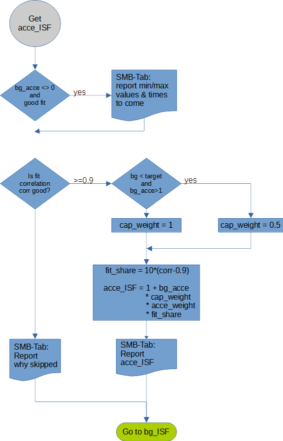

# acce_ISF determination and its impact

This is the latest contribution to
autoISF and has been in action since
late December 2021.

For things like glucose or delta to
change, there first must be an
acceleration. Therefore acceleration
recognises such changes earlier and is
used by autoISF to take pre-emptive
action.

Glucose and delta, its 1st derivative,
play a significant role in AAPS in
determining the insulin required.
Acceleration, its 2nd derivative, was not
included so far. One reason might be
that it is harder to extract from the
glucose history considering that delta
needed to be averaged already to
provide a reliable signal. In autoISF a
best fit algorithm is used to determine 
the parabola which best matches the
glucose data.

Once the formula for the parabola is
known it is then very easy to determine
the acceleration. Sometimes the fit has
bad correlation, i.e. it deviates too much
from the glucose readings. In such
cases there is no contribution from
acceleration and acce_ISF = 1.

Otherwise acce_ISF is calculated by

\\[ acce_ISF = 1 + acce_weight * fit_share * cap_weight * acceleration \\]

where
* fit_share a measure of fit quality, i.e. 0% if unacceptable up to 100% if perfect;
* cap_weight is 0.5 below target and 1.0 otherwise
* acce_weight 
  * is bgAccel_ISF_weight for acceleration away from target, i.e. mostly positive
  or bgBrake_ISF_weight for acceleration towards target, i.e. mostly negative

Initially I had assumed that the weights for accelerating and braking are of similar size. First experiences
say that the weight while decelerating should be 30-40% lower than for acceleration to reduce glucose
oscillations. Quite often the acce_ISF contribution plays the dominant role inside autoISF and is therefore
very important and delicate. Weights for acce_ISF of 0 disable this contribution. Start small with weights
like 0.02 and observe the results before increasing them. Keep in mind that negative acceleration will start
to happen while glucose is apparently still rising but the slope reduces. Here, acce_ISF will be <1, i.e.
sensitivity grows and less insulin than normal will be required even before the glucose peak is reached

