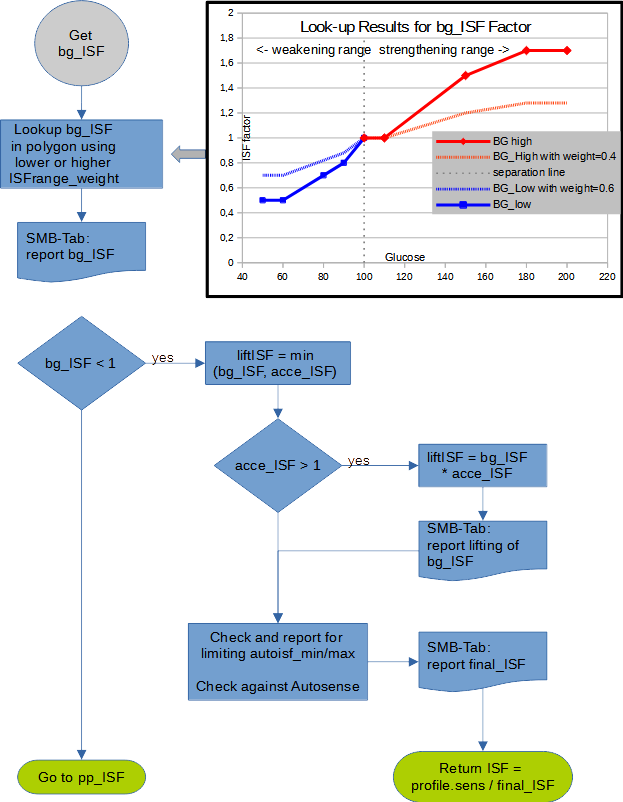

# bg_ISF determination and its impact

There are indicators that higher glucose
needs stronger ISF. This was evident from
all the successful AAPS users defining
automation rules which strengthen the
profile at higher glucose levels. The
drawback is that there are sudden jumps in
ISF at switch points and no further or minor
adaptations in between.

In autoISF a polygon is provided that
defines a relationship between glucose and
ISF and interpolates in between. This is
currently hard coded but the user can apply
weights to easily strengthen or weaken it in
order to fit personal needs. In principle the
polygon itself can be edited and the apk
rebuilt if a different shape is required.
Developing a GUI for that purpose was
considered very tedious especially before
knowing whether the results warrant the
effort. With this approach you could even
approximate the formula well enough that
is used in DynamicISF for the ISF
dependency on glucose.

There are two weighting factors depending on whether glucose is below or above target:

<table>
<tr>
<td>lower_ISFrange_weight</td>
<td>Used below target, weakens ISF the more the higher this weight is;
0 disables this contribution, i.e. ISF is constant in the whole range
below target.
This weight is less critical as the loop is probably running at TBR=0
anyway and you can start around 0.2.</td>

</tr>
<tr>
<td>higher_ISFrange_weight</td>
<td>Used above target, strengthens ISF the more the higher this weight is
0 disables this contribution, i.e. ISF is constant in the whole range
above target.
Start with a weight of 0.2 and observe the reactions and check the
SMB-tab before you increase it with care.</td>

</tr>

</table>

The result is:
\\[bg_ISF = 1 + xxx\\_ISFrange\\_weight * glucose\\_polygon\\_Lookup\\]

There is a special case possible, namely below target i.e. when bg_ISF<1. ISF will be weakened and there
is no point in checking the remaining effects. Only with positive acceleration the weakening will be less
pronounced as that is a sign of rising glucose to come soon.

