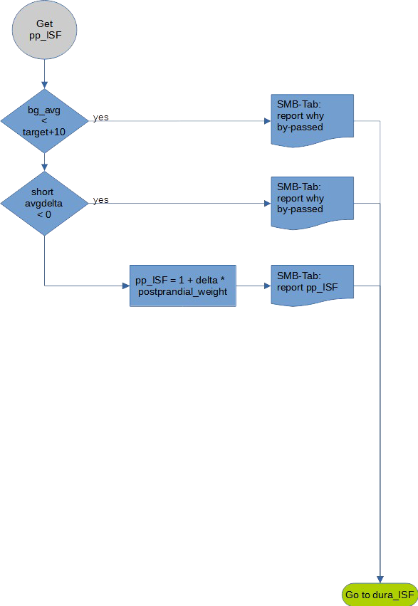

# pp_ISF determination and its impact

AutoISF can adapt ISF based on glucose
delta. It was introduced to help users with
gastroparesis. It is also useful for users in
pure UAM mode because in their case no
meal start can be detected. Given a
positive short_avgdelta and glucose being
above target+10 the result is:

\\[pp_ISF = 1 + delta * pp_ISF\\_weight\\]

As a starting value for pp_ISF_weight use
0.005. Observe the reactions and check the
SMB-tab before you increase it with care.
A weight of 0 disables this contribution.
